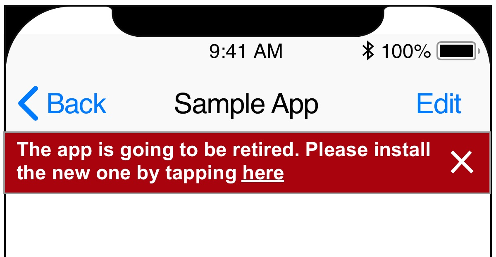
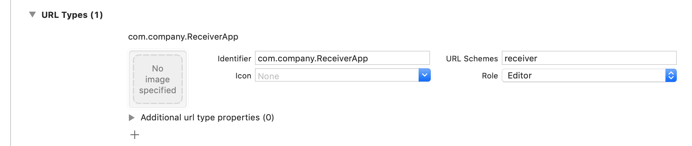
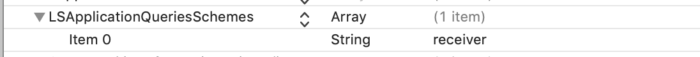

In my daytime job, I was working on a task to show a deprecation warning in our iOS app.  The app is very old now (and honestly outdated) and currently under maintenance mode. Our team decided to launch a brand new app in the app store with the hope that users would migrate to the latest app and ditch the old app.  The benefit of adding a different app in the app store is that it doesn’t force users to migrate right-away and they can continue using the old app for a short period. Once that period ends, we wouldn’t continue supporting old app for any more bug fixes and users would have to move to the new app. Pretty good strategy I would say!

So we wanted to show a deprecation warning banner in the old app which would inform of the new app and tapping on the banner link would take them to the new app. They also have an option to dismiss the banner by pressing on a “cancel” button. 

The UI would look something like this

So my task was to figure out how to open a new app from our old app when the user would tap on the text inside the banner?

Luckily, iOS makes it really easy and simple to handle this situation. iOS allows us to register custom URL schemes in our app thereby letting other apps use these custom URLs to trigger opening our app.

For the sake of simplicity, let’s assume that app “A” (sender) wants to open app “B” (receiver).

To get it working, we have to do the following:
 
1. Register a new custom URL type in Info.plist in app “B” 
2. Write code to in app “A” to open the custom URL
3. Whitelist the newly registered custom URL scheme in app “A”
4. (Optional) Write delegate logic to recieve the callback in app “B”

<ins>**Registering new custom URL type**</ins>

Register a new entry under `URL Types` inside the `Info` tab of the app project settings. You can also add this information directly in the `Info.plist`

<ins>**Write logic to open the receiver app**</ins>

Below shows some sample logic on how to open the receiver app from the sender app.


@IBAction func tapPressed(_ sender: Any) {
    let urlString = "receiver://user?username=grane"
    guard let url = URL(string: urlString) else {
        return;
    }
    if UIApplication.shared.canOpenURL(url) {
        UIApplication.shared.open(url, options: [:], completionHandler: nil)
    } else {
        UIApplication.shared.open(URL(string: "http://instagram.com/")!)
    }
}


<ins>**Whitelist the receiver app scheme in sender**</ins>

You will also need to whitelist the receiver app's custom scheme inside the sender app. Without this step, you won't be able to open the other app. To enable the whitelisting, add the custom url scheme in the `LSApplicationQueriesSchemes` array inside the `Info.plist` like this 

<ins>**Write delegate logic when opened app using custom URL**</ins>

When the sender app opens the receiever using the custom url scheme, an Application delegate method gets called in the receiver app. I wrote some code to demonstrate how the receiver app can verify if the sender app is actually opening the app and parse the custom scheme url parameters for more information.


func application(_ app: UIApplication, open url: URL, options: [UIApplication.OpenURLOptionsKey : Any] = [:]) -> Bool {
    let sendingAppID = options[.sourceApplication]
    print("source application = \(sendingAppID ?? "Unknown")")

    guard let components = NSURLComponents(url: url, resolvingAgainstBaseURL: true),
        let host = components.host,
        let params = components.queryItems else {
            print("Invalid host or user name missing")
            return false
    }

    if let username = params.first(where: { $0.name == "username" })?.value {
        print("host = \(host)")
        print("username = \(username)")
        return true
    } else {
        print("Username missing")
        return false
    }
}


### Things to note:
1. If the receiver app of the custom URL is not installed on the device, the iOS system won’t open the app store link directly. Ideally, I was expecting this to happen out of the box but sadly you need to add code for it. 
2. I found this [iTunes Link Maker](https://linkmaker.itunes.apple.com/en-us/details/389801252?country=us&mediaType=ios_apps&term=Instagram&type=software) tool specifically used to create app store links for any app you desire. You can use link directly to the app in the app-store by substituting the `https://` with `itms-apps://` in the direct link of any app like [‎Instagram app store link](itms-apps://apps.apple.com/us/app/instagram/id389801252?mt=8)

### Image credits:

Image by [Thomas Ulrich][image-user] from [Pixabay][image-src]

[image-user]: https://pixabay.com/users/LoboStudioHamburg-13838/?utm_source=link-attribution&amp;utm_medium=referral&amp;utm_campaign=image&amp;utm_content=3113279
[image-src]:   https://pixabay.com/?utm_source=link-attribution&amp;utm_medium=referral&amp;utm_campaign=image&amp;utm_content=3113279